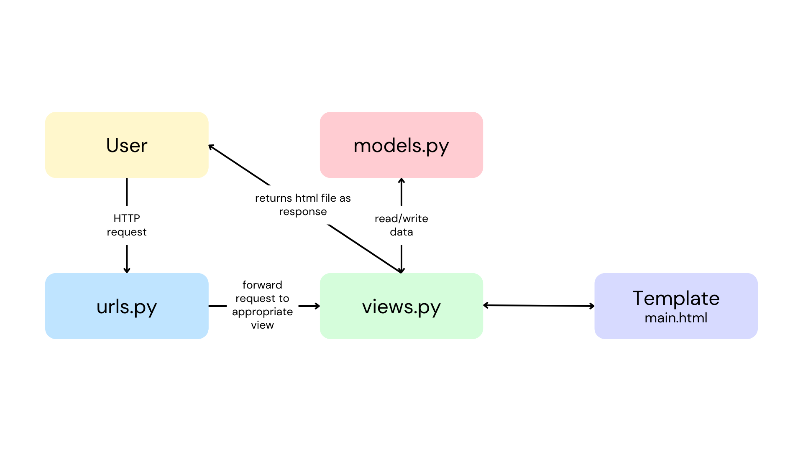
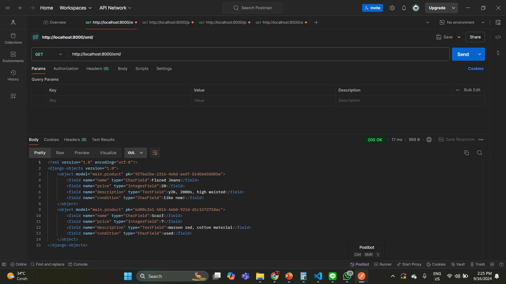
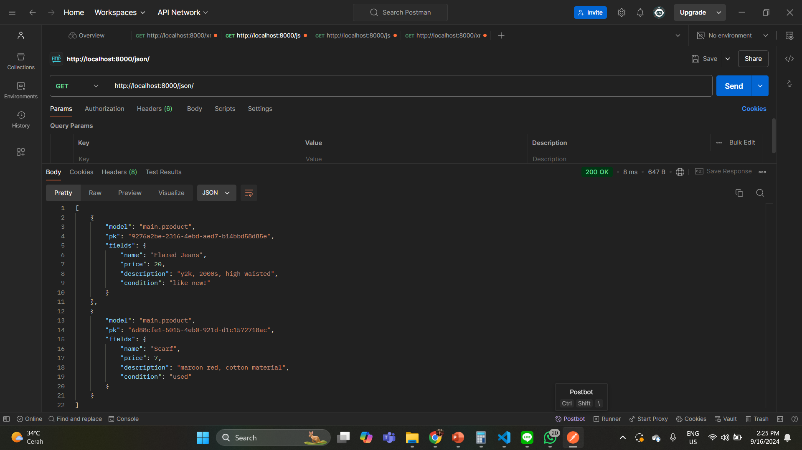

# :handbag::scarf: Thrifting Haven :boot::coat:

## [ASSIGNMENT 2](https://pbp-fasilkom-ui.github.io/ganjil-2025/en/assignments/individual/assignment-2)

## :paperclip: PWS application:
http://kusuma-ratih-thriftinghaven.pbp.cs.ui.ac.id/

## :memo: How to implement the checklist

### :ballot_box_with_check: Create a new Django Project
In order to create a new Django Project we have to:
+ Create a new directory named `thrifting-haven` and open the command prompt inside the new directory.
+ Create a virtual environment by running the command below
```
python -m venv env
```
+ Then activate the virtual environment with the following command, indicated with (env) on the terminal input line.
```
env\Scripts\activate
```
Afterwards, we set up dependencies in the same directory.
+ Create a `requirements.txt` file and add the following dependencies
```
django
gunicorn
whitenoise
psycopg2-binary
requests
urllib3
```
+ We install the dependencies by running the following command
```
pip install -r requirements.txt
```
Finally, we create a Django project named thrifting_haven by running the following command
```
django-admin startproject thrifting_haven .
```
Lastly, we need to configure the project and run the server.
+ To deploy we add the following to `ALLOWED_HOSTS` in `settings.py`:
```
ALLOWED_HOSTS = ["localhost", "127.0.0.1"]
```
+ Ensure `manage.py` is in the terminal’s active directory, then start the server with:
```
python manage.py runserver
```

### :ballot_box_with_check: Create an application with the name `main` in the project

Create a new application called `main` inside the `thrifting-haven` project by running the following command
```
python manage.py startapp main
```
To go into the next step, we make sure that the `settings.py` file inside `thrifting_haven` project directory has 'main' added to the `INSTALL_APPS` variable as shown below
```
INSTALLED_APPS = [
    ...,
    'main'
]
```

### :ballot_box_with_check: Perform routing in the project so that the application main can run
In order to configure the URL routing for the 'main' application we need to:
+ Create a `urls.py` file in the `main` directory with the following contents:
```
from django.urls import path
from main.views import show_main

app_name = 'main'

urlpatterns = [
    path('', show_main, name='show_main'),
]
```

### :ballot_box_with_check: Create a model in the application `main` with the name `Product` 
The following needs to be put into `models.py` in order to have the following attributes:
+ `name` as the name of the item with type CharField.
+ `price` as the price of the item with type IntegerField.
+ `description` as the description of the item with type TextField.
```
from django.db import models

class Product(models.Model):
    name = models.CharField(max_length=100)
    price = models.IntegerField()
    description = models.TextField()
    condition = models.CharField(max_length=100)
```

### :ballot_box_with_check: Create a function in `views.py` to return to an HTML template that displays the name of the application and your name and class
The code declares the show_main function, which accepts a request parameter. We hereby add a function that will handle HTTP requests and return the appropriate view such as the following:
```
from django.shortcuts import render

def show_main(request):
    context = {
        'application_name' : 'thrifting-haven',
        'class': 'PBD',
        'name': 'Kusuma Ratih Hanindyani'
    }

    return render(request, "main.html", context)
```

### :ballot_box_with_check: Create a routing in `urls.py` for the application `main` to map the function created in `views.py`
To add a URL route in the project's urls.py to connect it to the main view we need to open the `urls.py` file inside of the `thrifting_haven` project directory, not the one inside the `main` directory.

+ Import the include function from django.urls.
```
...
from django.urls import path, include
```

+ Add the following URL route to direct to the main view within the urlpatterns variable.
```
urlpatterns = [
    ...
    path('', include('main.urls')),
    ...
]
```

### :ballot_box_with_check: Perform deployment to PWS so that it can be accessed by others via the Internet
In order to deploy to PWS at https://pbp.cs.ui.ac.id we have to:
+ create a new project labeled as `thriftinghaven`
+ on the `settings.py` file of the Django project, add the PWS deployment URL to the ALLOWED_HOSTS field such as shown below
```
ALLOWED_HOSTS = ["localhost", "127.0.0.1","kusuma-ratih-thriftinghaven.pbp.cs.ui.ac.id"]
```
+ Do a git `add`, `commit`, and `push` for deployment to the PWS.

## :ballot_box_with_check: Create a `README.md` that contains a link to the PWS application that has been deployed
To create a README.md, simply open the used IDE (VS code) and add a `README.md` file to the project directory `thrifting-haven`.

## :bar_chart: Diagram that contains the request client to a Django-based web application and the response it gives, explaining the relationship between `urls.py`, `views.py`, `models.py`, and the `html` file

+ The user's request will first be processed and then forwarded to the appropriate view.
+ The view will then read/write data from the Model and use a Template to display and return the response to the user.

## :outbox_tray: The use of `git` in software development 

Git is essential in software development for managing code versions and enabling collaboration. It allows multiple developers to work on different parts of a project simultaneously by using branches, which can later be merged into the main codebase. Git also tracks changes, providing a history of modifications that makes it easy to revert to previous versions if needed. It also integrates with platforms like GitHub or GitLab, facilitating code reviews and ensuring code quality. 

## :chart_with_upwards_trend: Why Django is used as the starting point for learning software development

Django is a popular choice for beginners because it’s simple, easy to understand, and comes with many built-in tools that make web development easier. Since it’s based on Python, which is known for its clear and straightforward syntax, it's great for learning. Django helps you focus on building your project without worrying too much about complex details, like handling databases or user logins. It also teaches good practices in organizing code, making it a solid foundation for anyone starting in software development.

## :bulb: Why the Django model is called an ORM

Django’s model is called an ORM (Object-Relational Mapper) because it helps you work with databases using Python code instead of writing SQL queries. It turns Python classes into database tables and class attributes into table columns. This makes it easier to manage the database, letting you add, update, or delete data using Python without needing to learn SQL.

## [ASSIGNMENT 3](https://pbp-fasilkom-ui.github.io/ganjil-2025/en/assignments/individual/assignment-3)

### :ballot_box_with_check: Creating a form input to add a model

In order to reduce the possibility of redundancy of code we create a skeleton that acts as a base for views.
+ Create a directory `templates` in the `main` directory and create a new HTML file named `base.html`. 
+ In the `settings.py` file of the `thrifting_haven` directory you add the following to the `TEMPLATES` variable 
```
'DIRS': [BASE_DIR / 'templates'],
```

+ Create a new file in the `main` directory with the name `forms.py` so that it can receive Product datas
```
from django.forms import ModelForm
from main.models import Product

class ThriftEntryForm(ModelForm):
    class Meta:
        model = Product
        fields = ["name", "price", "description", "condition"]
```
+ Change the Primary Key From Integer to UUID by adding the following to the `main` subdirectory
```
import uuid  # add this line at the very top
...
class MoodEntry(models.Model):
    id = models.UUIDField(primary_key=True, default=uuid.uuid4, editable=False)  # add this line
...
```
+ Open the `views.py` file in the `main` directory and add `from django.shortcuts import render, redirect` at the top of the file
+ Create a new function to add new products
```
def create_product(request):
    form = ThriftEntryForm(request.POST or None)

    if form.is_valid() and request.method == "POST":
        form.save()
        return redirect('main:show_main')

    context = {'form': form}
    return render(request, "create_product.html", context)
```

### :ballot_box_with_check: Add 4 views to view the added objects in XML, JSON, XML by ID, and JSON by ID formats

To access the XML and JSON data from the forms directly we insert the following functions into `views.py`
```
def show_xml(request):
    data = Product.objects.all()
    return HttpResponse(serializers.serialize("xml", data), content_type="application/xml")

def show_json(request):
    data = Product.objects.all()
    return HttpResponse(serializers.serialize("json", data), content_type="application/json")

def show_xml_by_id(request, id):
    data = Product.objects.filter(pk=id)
    return HttpResponse(serializers.serialize("xml", data), content_type="application/xml")

def show_json_by_id(request, id):
    data = Product.objects.filter(pk=id)
    return HttpResponse(serializers.serialize("json", data), content_type="application/json")
```

### :ballot_box_with_check: Create URL routing for each of the views added in point 2.

+ Open the `urls.py` file in the `main` directory and import the previous functions such as the following
```
from main.views import show_main, create_mood_entry, show_xml, show_json, show_xml_by_id, show_json_by_id
```
+ Add the URL path to the `urlpatterns` variable in the `urls.py` file in the `main` directory to access the functions that were imported such as the following
```
    path('xml/', show_xml, name='show_xml'),
    path('json/', show_json, name='show_json'),
    path('xml/<str:id>/', show_xml_by_id, name='show_xml_by_id'),
    path('json/<str:id>/', show_json_by_id, name='show_json_by_id'),
```

## :mailbox_with_mail: Why we need data delivery in implementing a platform

The main reason data delivery is essential in implementing a platform is to ensure that users receive the information they need quickly and accurately, enabling seamless interaction with the platform. This enhances the user experience by ensuring real-time data access, maintaining data consistency, and supporting essential platform functions like displaying content, processing transactions, and integrating with external systems, all while ensuring performance, scalability, and security.

## XML or JSON? Why is JSON more popular than XML?
JSON is more popular than XML primarily due to its simplicity and ease of use. JSON (JavaScript Object Notation) has a more compact and readable syntax, making it easier for developers to write, parse, and debug. Since JSON is closely aligned with JavaScript, which is widely used in web development, it integrates seamlessly with modern web technologies, while XML requires more verbose syntax and can be harder to read. JSON's lightweight structure and native support in many programming languages make it faster and more efficient, especially for web APIs, which prefer simplicity and speed. In contrast, XML's additional features like namespaces and schemas are often unnecessary for many modern applications.

## The functional usage of `is_valid()` method in Django forms. Also explain why we need the method in forms.

The is_valid() method in Django forms checks if the data entered into the form is correct and follows the required rules, such as proper format and completeness. If the data is valid, it returns True and stores the cleaned data for further processing; if not, it returns False and provides error messages. This method is essential to ensure that only valid and safe data is submitted and used, preventing errors and security issues in the application.

## :minidisc: Why we need `csrf_token` when creating a form in Django? What could happen if we did not use csrf_token on a Django form? How could this be leveraged by an attacker?

The `csrf_token` in Django forms is essential to protect against Cross-Site Request Forgery (CSRF) attacks, which occur when a malicious website tricks a user into making unwanted requests to another site where they are authenticated. By using `csrf_token`, Django ensures that form submissions are legitimate and come from the same user who loaded the page. Without it, attackers could exploit this vulnerability by tricking users into performing unintended actions, such as changing account settings or transferring funds, potentially compromising the security of the web application.

## :postbox: Postman Results

### XML


### JSON 


### XML by ID


### JSON by ID
